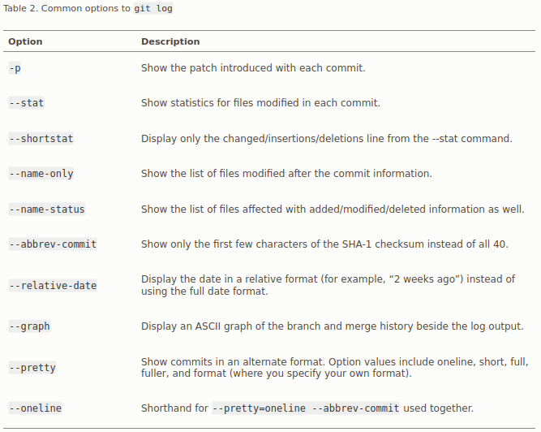

# Initialisation ou récupération d'un repository

Il existe deux façons de débuter avec git : 

* Initialiser un repository git dans un dossier déjà existant localement
* Cloner un dépôt distant. 

## Initialisation d'un repository.

Dans le cadre de cet exercice nous allons initialiser un dépôt git à partir d'un dossier existant. 

* Créez un dossier gitTp.
* Déplacez-vous dans ce dossier et créez un fichier html basique avec un hello world et une feuille de style css vide nommée elle aussi helloworld.css. 
* Entrez la commande `git init` 

Vous devriez alors avoir un retour de ce type :

* Dépôt Git vide initialisé dans `chemin/gitTp/.git/`

Ce retour signifie que git a créé un sous dossier .git contenant tous les éléments d'un squelette vide de git. 

A ce stade nous allons utiliser la commande `git status`. Cette dernière nous donne un suivi des différents états des dossiers et fichiers suivis. Dans notre cas nos deux fichiers ne sont pas suivis et apparaissent donc en rouge et précédés de la mention suivante:

>Fichiers non suivis: (utilisez "git add <fichier>..." pour inclure dans ce qui sera validé)

Ainsi dans le workflow nous devons maintenant ajouter les fichiers au suivi.

Dans notre cas nous souhaitons que chaque élément déjà présent à ce moment dans le dossier gitTp soit suivi, à savoir notre fichier html et notre fichier css. Pour cela nous allons utiliser la commande `git add .`

Arrêtons nous sur cette commande quelques instants. Elle a permis d'enclencher le suivi de modification des deux fichiers. Ils seront désormais suivis et à chaque commit leur état sera enregistré. Il est à noter que l'on peut aussi préciser des dossiers ou fichiers spécifiques à suivre. Il est enfin à noter que tout nouveau fichier ou dossier créé devra d'abord être ajouté via cette commande. 

Nous allons maintenant réeffectuer la commande `git status`. Les deux fichiers apparaissent cette fois en vert avec la mention 

>Modifications qui seront validées : (utilisez "git rm --cached <fichier>..." pour désindexer)
>
> nouveau fichier : helloworld.css
>
> nouveau fichier : helloworld.html

Dernier point pour créer un nouvel instantané (snapshot) localement nous allons exécuter la commande `git commit`. 

Lors de l'exécution de `git commit` l'éditeur de texte définit précédemment va se lancer, il faudra alors enregistré une description du commit. Il est possible d'enregistrer directement un message en utilisant le modificateur `git commit -m 'ceci est un message de commit d'exemple'`.

Le commit initial va alors créer une première image instantanée ou snapshot, à partir de celle ci toute modification des éléments trackés sera prise en considération comme nous le verrons plus tard. 

Une dernière exécution de la commande `git status` vous donnera la sortie suivante :
>Sur la branche master
>
>rien à valider, la copie de travail est propre

On voit donc maintenant que tous nos fichiers sont exactement tels qu'ils étaient à la version précédente. 
  
On notera également que la commande git status nous donne la branche actuelle utilisée. 
 
## Clonage d'un repository
  
Si vous souhaitez copier un dépôt git existant la commande `git clone` va vous permettre de réaliser cette action. 

Ce que va faire cette commande c'est copier localement l'ensemble d'un dépôt git, incluant les fichiers eux-mêmes mais aussi l'ensemble de l'historique de modification comme déjà vu précédemment. Pour décomposer cette commande, elle va donc créer un dossier ayant pour nom celui du projet git que vous clonez. Elle va ensuite créer et initialiser un répertoire `.git`, va récupérer toute la data pour ce dépôt, puis va finalement récupérer l'image de la derniere version de ce dépôt. 

La composition exacte de la commande git clone est la suivante :

> git clone \<url\>

\<url\> peut prendre trois types de valeur : 
* Une url sous protocole `https://` par exemple https://github.com/testdepot
* `git://` qui permettra de récupérer également un dépôt git
* ou encore `user@server:path/to/repo.git`
  
Chacune de ces trois méthodes d'appel ayant le même résultat.

# Effectuer des changements sur un dépôt git
	
## Flow basique
  
Le but d'un dépôt git est bien entendu d'être évolutif, pour cela il faut se rappeler les points capitaux des 3 états vus précédemment ainsi que la notion de tracking ou non tracking des différents fichiers.

Nous allons maintenant effectuer les étapes suivantes :
  
* Créer un fichier helloworldbis.html
* Modifier le fichier helloworld.css en rajoutant les éléments suivants `h1 {
	color:red;
}
`

Après avoir réalisé ces étapes, refaisons un git status, voici la sortie que vous devriez avoir :
	

La commande nous indique donc l'état des différents fichiers. 
	
* Il nous signifie que des modifications ont été faites au niveau du fichier helloworld.css, mais que celles ci n'ont pas été commit.
* Il nous indique également qu'un fichier n'est pas tracké pour l'instant. 

Nous n'avons pour l'instant pas l'intention de pousser helloworld.bis. Nous voulons cependant pousser la modification de notre css vers le commit.
	
Nous allons donc utiliser la commande `git add helloworld.css`. Il est donc à noter que la commande `git add` sert non seulement à ajouter un nouveau fichier au suivi, mais aussi à ajouter les modifications que nous souhaitons avant tous nos commits. 

La bonne pratique reste de commiter aussi souvent que nécessaire, la nécessité s'exprimant par la finalisation d'une entité logique. On appelle cette action d'ajouter au suivi un élément modifié via la commande `git add` le fait de stager un fichier. 
		
Après l'utilisation de cette commande le retour de `git status` sera le suivant :
	

Attention cependant si vous remodifiez le fichier avant de commit, il sera poussé dans le commit avec la dernière version stagée, et non avec les dernières modifications. Il faudra alors rejouer la commande `git add`. Votre git status vous indiquera cependant qu'il est à la fois dans les versions stagées et non stagées comme sur le screenshot suivant : 

Stageons à nouveau le fichier.

Nous pouvons maintenant committer nos changements en étant sûrs que nous ne committons que ce que nous souhaitons vraiment ! Utilisons la commande `git commit -m "modification de la css"` .

L'ensemble des commandes vues jusqu'ici peuvent être résumées par le schéma de cycle de vie suivant :
	

## Autres commandes aidant à la modification ou au contrôle de la modification

### Ignorer des fichiers
	
Il peut être très pratique d'ignorer des fichiers dans le git. Il s'agit par exemple de fichiers de configuration locaux, comme des set up d'environnement de développement, ou bien des logs etc.
	
La gestion des fichiers ignorés par git est dans un fichier nommé ".gitignore". 
	
Nous allons dans un premier temps créer ce fichier à la racine de notre dossier gitTp. `touch .gitignore`

Nous allons ensuite ouvrir ce fichier et tapper `helloworldbis.html` à l'intérrieur puis le refermer.

Puis ensuite relancer un `git status`.

Ce retour nous montre donc que nous n'avons pas poussé le .gitignore, mais néanmoins le fichier helloworldbis.html est quant à lui bien ignoré par git. Il ne nous reste donc plus qu'a faire `git add .gitignore` puis un `git commit -m "ajout du .gitignore"` .

Il est à noter que dans notre cas nous avons directement viser un fichier, mais que le fichier gitignore support les syntaxes suivantes :
- Les lignes vides ou commençant par \# sont ignorées.
- Les patterns "globs"[^1] fonctionnent et sont appliqués récursivement.
- On peut commencer un pattern par / pour éviter la récursité.
- On peut terminer un pattern pour 

Voici quelques exemples de fichier .gitignore : 
>ignore all .a files
>
>`*.a`

>but do track lib.a, even though you're ignoring .a files above
>
>`!lib.a`

>only ignore the TODO file in the current directory, not subdir/TODO
>
>`/TODO` 

>ignore all files in any directory named build
>
>`build/`

>ignore doc/notes.txt, but not doc/server/arch.txt
>
>`doc/*.txt`

>ignore all .pdf files in the doc/ directory and any of its subdirectories
>
>`doc/**/*.pdf`

Vous pouvez trouver une liste complète de .gitignore configurée pour tous les langages [ici](https://github.com/github/gitignore)

### Git status -s et git diff 

La commande `git status -s`. Cette commande est une version compressée de git status, nous n'entrerons pas dans les détails qui doivent être transparents pour vous maintenant, mais elle permet de faire un check rapide de vos modifications. 
	
La commande `git diff` quant à elle permet une exploration en détail des modifications qui n'ont pas encore été stagées. Elle compare donc votre working directory au staging, et vous donne les modifications non encore stagées. Cette commande ne retournera rien si vous avez stagé toutes vos modifications. 

La commande `git diff --staged` permet une comparaison de votre stage par rapport à votre dernier commit. 

### Commiter sans avoir à stager tous les fichiers déjà suivis. 
	
La commande `git commit -a` permet de commiter tous les changements de tous les fichiers suivis mais qui n'ont pas été stagés. 

Cela peut être pratique mais attention vous pouvez commiter des fichiers non voulus. Dernier point cette commande ne permet pas d'ajouter des fichiers qui n'ont pas été trackés au moins une fois. Il faudra donc tout de même faire un `git add` pour les nouveaux fichiers. 

### Supprimer un fichier

Pour supprimer un fichier il existe deux méthodes. 
	
La première consiste à supprimer physiquement de votre dossier le fichier, puis a ajouter via la commande `git add` la suppression de ce fichier.

La deuxième consiste à utiliser la commande `git rm` avec le nom du fichier afin d'effacer le fichier dans votre working directory. Il ne sera plus non plus visible dans vos prochains commits. 

Si vous avez déjà modifié le fichier ou qu'il était déjà dans la zone de staging vous devrez forcer le remove avec le modificateur `-f` . C'est une mesure de sécurité pour éviter les suppressions accidentelles. 

Une autre possibilité est de conserver le fichier sur votre disque dur mais de l'effacer de git uniquement pour cela on utilisera la commande `git rm --cached` puis le nom du fichier. Cela est utile pour conserver des logs mais qui auraient été oubliés dans le .gitignore.
	
Dernier point la commande git rm supporte les globs patterns.
	
### Déplacement de fichier.
	
Git gérera le déplacement de fichier via la commande `git mv`, mais vous pouvez également déplacer les fichiers manuellement puis les réajouter dans git après, en supprimant l'ancienne référence. 
	
# Comprendre l'historique des commits. 
	
## Afficher l'historique des commits avec la commande `git log`

Nous allons utiliser un dépôt git déjà disponible. 
	
Pour cela créez un nouveau dossier et utilisez la commande suivante : `git clone https://github.com/schacon/simplegit-progit`

Une première approche de `git log` consiste à simplement l'éxécuter sans aucun paramètre.
	
Dans notre dépôt de test nous avons le rendu suivant : 

	
La commande git log par défaut a les caractéristiques suivantes : 
* Elle liste les commits par ordre chronologique inversé
* Chaque commit et listé avec son checksum
* Le nom de l'auteur et son email est présent
* La date du commit est également présente
* Le message du commit est également présent (d'où l'importance d'un message explicite et de commits réguliers !)
	
La commande git log accepte un grand nombre de specifier et d'options vous permettant de préciser ce que vous recherchez dans l'historique. Cet aspect est particulièrement pratique pour la compréhension d'un nouveau projet et à des fins d'administration. 
	
Nous n'allons pas les passer toutes en revue ici en détail, mais nous allons cependant les rappeler avec leurs fonctions dans les deux tableaux suivants[^2] :

[^1]: Glob patterns are like simplified regular expressions that shells use. An asterisk (*) matches zero or more characters; [abc] matches any character inside the brackets (in this case a, b, or c); a question mark (?) matches a single character; and brackets enclosing characters separated by a hyphen ([0-9]) matches any character between them (in this case 0 through 9). You can also use two asterisks to match nested directories; a/**/z would match a/z, a/b/z, a/b/c/z, and so on. Source : https://git-scm.com/book/en/v2/Git-Basics-Recording-Changes-to-the-Repository
[^2]: Ces tableaux et les suivants sont tirés de la source suivante : https://git-scm.com/book/en/v2/Git-Basics-Viewing-the-Commit-History
